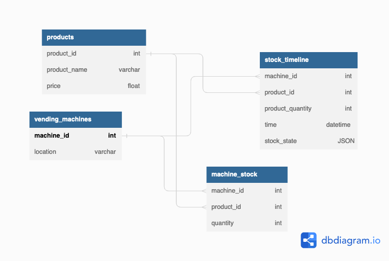

[](https://sonarcloud.io/summary/new_code?id=BlackTea13_vending-machines)
[](https://sonarcloud.io/summary/new_code?id=BlackTea13_vending-machines)


# Vending Machine Tracker API
### Project Structure

---

```
.
├── README.md
├── app
│   ├── extensions.py
│   ├── machine_stock
│   ├── main
│   │   └── routes.py
│   ├── models
│   │   ├── machine_stock.py
│   │   ├── product.py
│   │   └── vending_machine.py
│   ├── product
│   │   └── routes.py
│   └── vending_machine
│       └── routes.py
├── config.py
└── tests
```
### Requirements

---

Make sure poetry is installed on your machine. After, run this command in the project directory.
```
poetry install
```


### Database Connection

---

Make sure you have docker installed and run
```
docker compose up -d
```

### API Sheet

---

#### Vending Machine
View all vending machines
```
GET /vending-machine/all/
```
View a vending machine, have either `machine_id` or `location` in the request
arguments
```
GET /vending-machine/
```
Create a vending machine, have `location` in the form
```
POST /vending-machine/create/
```
Delete a vending machine, have `machine_id` to be deleted in the form
```
POST /vending-machine/delete/
```
Add a product to a machine, have `machine_id`, `product_id`, and `quantity` in the form
```
POST /vending-machine/add-product/
```

#### Product
View all products
```
GET /product/all/
```
View product with `product_id` in arguments
```
GET /product/
```
Create product with `product_name` and `price` in form
```
POST /product/create/
```
Delete a product with `product_id` in form
```
POST /product/delete/
```

### Database ER


**By Robert Emil Rachanat Blum**
